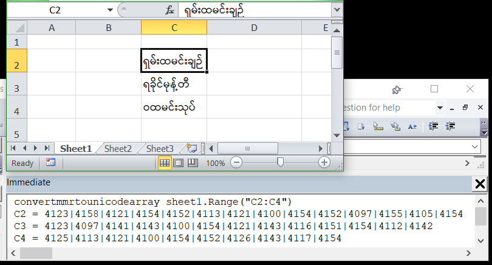
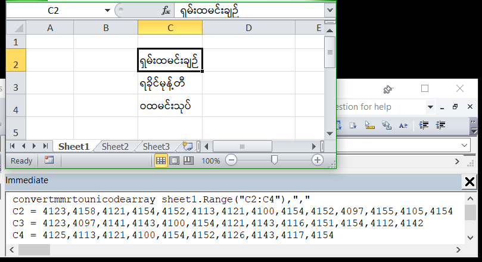
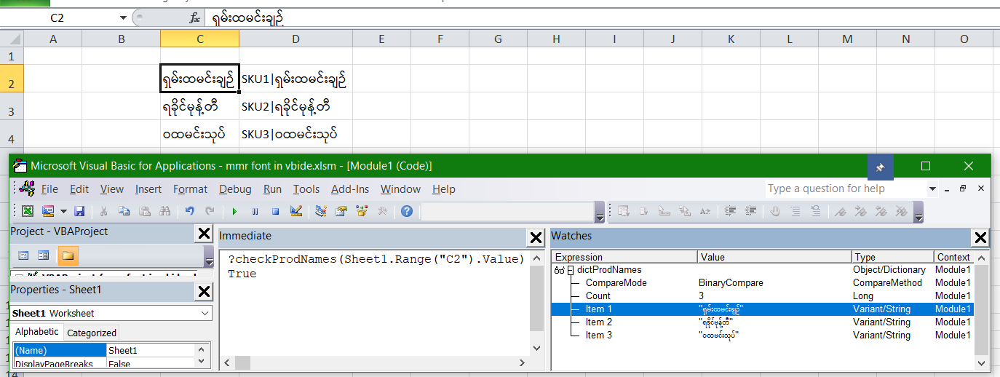

# Myanmar Unicode Support in Excel VBEditor
NO. IT IS NOT SUPPORTED. AND THIS REPO CONTAINS NO METHOD TO SUPPORT IT!

## A Brief Review of Approaches to Visualize Unicode in VBIDE in MS Excel
This is going to be just discussing ways to show Unicode characters in Excel's VBEditor.\
The premises I shall base all this upon, are, <b>MS Excel 2010, Myanmar Unicode font: Pyidaungsu</b> only.\
For any other situation, I have no guarantee that this discussion could be applicable. So, YMMV.

### I. Cause of Problem
Why do I even have to discuss this?\
There are many Myanmar people who find this situation frustrating, including me, when we tried to write Myanmar words in Myanmar Unicode fonts like, Pyidaungsu.\
While it is generally easy to find out the cause, most people who started writing VBA code doe not even have the necessary googling skills just find out nor the basic English language skills, nor the coding knowledge to understand that, the VBE(VBIDE/Visual Basic Editor) only works with ANSI codepage, thus, it cannot show Unicode characters. Period. Microsoft will not fix this, as of right now, 11DEC2023 09:30AM MMR STD time.\
And all that we type in VBE in Myanmar Unicode font will show up like "???".

### II. How do we approach this problem?
#### II.1.Referencing a value on another worksheet
This is the simplest method.\
I was a n00b once but even back then, if I wanted to check whether a variable is equal to item(s) written in Myanmar Unicode font,
```vba
If sProdName = "ရှမ်းခေါက်ဆွဲ" Then
```
I realized that we can just employ a simple method like below.\
I just need to put the word ရှမ်းခေါက်ဆွဲ in Cell A1 of worksheet Sheet1 and reference from the code like:
```vba
If sProdName = Sheet1.Range("A1").Value then
```
While there's nothing wrong with this approach, there are a few pros and cons about this.
|No.|pros|cons|
|---|---|---|
|1|Easy to accomplish|FileSize bigger because of extra sheet|
|2|End-User could update values per their requirements|End-User could mess up|
|3|Could be a feature|Remedy above with changing worksheet visibility|
|4|Does not affect code size (lines count)|Can get corrupted|
|5|No need to (write functions to) convert values|Savvy users can find out values even inside veryHidden sheets|
|6|N00B friendly|Too simple|

#### II.2.Convert Myanmar Unicode String to Unicode number and convert it back to Unicode String at run-time
This may seem like hard for a n00b but the concept is still simple.\
Basically, we just need some Sub/Function to convet a list of Myanmar Unicode text values on a worksheet to get their respective Unicode character codes printed out to Immediate window.\
This is a one-time process. However, we could repeat this as much as we need/want.\
The proposed function could be as simple as what's outlined below:
```vba
'Sub to collect unicode values to be used as arrays or string in subs/functions
Sub convertMMRtoUnicodeArray(Optional theSeparator As String = "|") 
  Dim oneCell, i As Integer, st As String
  For Each oneCell In Sheet1.Range("C2:C4") 'change range as required
    st = ""
    For i = 1 To Len(oneCell)
      st = st & IIf(st = "", "", IIf(theSeparator <> "|", theSeparator, "|")) & AscW(Mid(oneCell, i, 1))
    Next i
    Debug.Print oneCell.Address(False, False) & " = " & st
  Next oneCell
End Sub
```
Above function could be easily shortened to become a one-liner we can run inside the Immediate window, without needing to write a function in CodePane inside of VBE:
```vba
for each oneCell in range("C2:C4"):st="":for i=1 to len(oneCell):st=st &iif(st="","","|") &ascw(mid(oneCell,i,1)) :next i:?st:next oneCell
```

The output of above Sub can be observed below:


The same Sub with comma(s) "," or any other separator(s) for any other purposes desired:


From the included screenshots, it is clear that the SubRoutine above just converted each Myanmar character/diacritics into it's own Unicode numbers according to the order that they were entered into the cells.\
NB:It is worth noting here that the above concept/code/implementations are all assumed to be used with Windows builtin Myanmar Keyboard known as, "Myanmar Keyboard (Visual Order)".\
The way the Myanmar words were entered into the cells should be like ရ,ှ,မ,်,း,ထ,မ,င,်,း,ခ,ျ,ဉ,် as for ရှမ်းထမင်းချဉ် in C2.\
Therefore, the Unicode number sequence was captured as 4123,4158,4121,4154,4152,4113,4121,4100,4154,4152,4097,4155,4105,4154 representing the whole word in C2.

Once we get the Unicode character codes of the values we want to hardcode into our code, we can put them into variables with a function like below:

<pre lang="vba"> 
'Sub to hardcode/save Unicode numbers in arrays or strings to be saved into Dictionary for further checking
Private Sub saveProdNamesInDict()
  Dim arrTest, oneMMRname
  Dim oneProdName As String
  Dim rowIncrement As Long: rowIncrement = 0
  Dim ShanSourRice As String
  ShanSourRice = "4123|4158|4121|4154|4152|4113|4121|4100|4154|4152|4097|4155|4105|4154"
  Dim RakhineNoodleSoup
  RakhineNoodleSoup = Array(4123, 4097, 4141, 4143, 4100, 4154, 4121, 4143, 4116, 4151, 4154, 4112, 4142)
  Dim WaMixedRice As String
  WaMixedRice = "4125|4113|4121|4100|4154|4152|4126|4143|4117|4154"
  arrTest = Array(ShanSourRice, RakhineNoodleSoup, WaMixedRice)
  Set dictProdNames = CreateObject("Scripting.Dictionary")
  For Each oneMMRname In arrTest
    oneProdName = <b>convertToString(oneMMRname)</b>
  If Not dictProdNames.exists(oneProdName) Then
      dictProdNames.Add Key:=oneProdName, Item:="SKU" & rowIncrement + 1 & "|" & oneProdName
    End If
    'Sheet1.Range("C2").Offset(0 + rowIncrement, 1).Value = dictProdNames(oneProdName): rowIncrement = rowIncrement + 1
  Next oneMMRname
End Sub
</pre>

While using a Dictionary is not really necessary, it was done so here, just to highlight how to best use the information+structures we have in VBA, to improve the usability of the code.\
In the above Sub, one variable was declared as a String of Unicode character code numbers while another was declared as an Array of Unicode character code numbers.\
The intent here was, to point out that it is up to the individual to choose whichever structure to hold the data, as they desired.\
In the above Subrountine, on Line-14, <code>oneProdName = <b>convertToString(oneMMRname)</b></code>, we used a function called convertToString to re-convert the Unicode character codes stored as Strings and/or Arrays back to Myanmar Unicode characters.\
That function can be found as below:
```vba
Function convertToString(incomingVar As Variant) As String
  Dim arrIncoming, Unicode
  If TypeName(incomingVar) = "String" Then
    arrIncoming = Split(incomingVar, IIf(InStr(incomingVar, ",") = 0, "|", ","))
  Else
    arrIncoming = incomingVar
  End If
  Dim retSt As String: retSt = ""
  For Each Unicode In arrIncoming
    retSt = retSt & ChrW(Unicode)
  Next Unicode
  convertToString = retSt
End Function
```
Above is a very simple function that just takes a variant (because I have decided to allow liberal use of Strings and/or Arrays to hardcode Unicode character codes) as an argument and assigned it into a local Array variable to be processed using <code>ChrW</code> function to be returned as Myanmar Unicode String value as Function return value.\
Here, we can just use <code>Join</code> function as doing so won't get back the String value stitched together as it was in original Myanmar Unicode Text String.

Now that we have finished 1) gathering data, 2) converting into hard-code ready format 3), storing hard-coded values inside a Dictionary, we have only one remaining task, which is, a function to check whether a value exists inside our <code>Dictionary</code> which goes as follows:
```vba
Function checkProdNames(oneProdName As String) As Boolean
  If dictProdNames Is Nothing Then
    Call saveProdNamesInDict
  Else If (Not dictProdNames Is Nothing) And dictProdNames.Count = 0 Then
    Call saveProdNamesInDict
  End If
  checkProdNames = dictProdNames.exists(oneProdName)
End Function
```
Not all of the above SubRoutines and Functions were necessary but more like they were there to make our lives easier.\
We could directly save Myanmar Unicode Text Strings into Dictionary directly like:
```vba
dictProdNames.Add Key:=Sheet1.Range("C2").Value, Item:=Sheet1.Range("C2").Value & "|SKU" & rowCounter
```
however, I went the hard way because I wanted to highlight how to eliminate the need to maintain a worksheet containing Myanmar Unicode Text String but just directly store hard-coded Strings/Arrays of Unicode character codes <b>included inside the code</b>.

All of the aforementioned codes can be place anywhere but preferably inside their own code modules.\

Here comes the part on how we can check a variable against existing/stored Myanmar Unicode Text String like:
```vba
If sProdName = "ရှမ်းထမင်းချဉ်" Then
```
I could write code like that but why satisfy with simple when we can go complicated!


The following Worksheet_Change event handler code should be placed in Sheet1's code module.
```vba
Private Sub Worksheet_Change(ByVal target As Range)
  Dim SKUnumber As String
  If Not Application.Intersect(Me.Range("C:C"), target) Is Nothing Then
    If target.CountLarge > 1 Then Exit Sub
    If target.Value = "" Then Exit Sub
    If checkProdNames(target.Value) Then
      SKUnumber = "is = " & Split(dictProdNames(target.Value), "|")(0)
    Else
      SKUnumber = "NOT in DB!"
    End If
    Application.EnableEvents = False
    target.Offset(0, 1).Value = SKUnumber
    Application.EnableEvents = True
  End If
End Sub
```
In the above event handler code, we can see:
```vba
If checkProdNames(target.Value) Then
```
which is equivalent or better than:
```vba
If sProdName = "ရခိုင်မုန့်တီ" Then
```
to me, at least.

### Conclusion
To a n00b, it might seem like the end of the world if we can't write Myanmar Unicode values inside VBIDE.\
I know because I was once a n00b too and I remember feeling exactly like that.

However, n00bs should understand that VBIDE can still process the Myanmar Unicode values inside the RAM even if it can't show/render Unicode font to be displayed.\
We need to have problem solving skills which could be attained by lateral thinking and thinking out of the box.

All programmers got stump at one point or another but don't let it stop you. Try and find a way to circumvent around a problem, because, there's always one out there.

### Further Explorations
We could save Myanmar Unicode values into a .txt file and extract it at runtime as the workbook is opened.\
We could combine maintaining an extra worksheet containing Myanmar Unicode values and converting to Unicode character codes together.\
We could probably SubClass the VBIDE's code panes and change them to Unicode compatible windows via Win32API function calls but this may not be very cost efficient and won't be very stable, IMHO.

### Extra Material
I included the following video to further enhance what's I've mentioned above.
<video width="1910" height="948" src="https://github.com/4R3B3LatH34R7/MyanmarUnicodeSupportInExcelVBEditor/assets/53028471/cec9fb5f-936b-4899-9910-fc537b7f33fd"></video>
